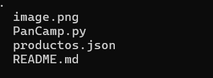

# Trabajo_Python_PerezYessica
Elaboración de la página de una panaderia.

## Descripción
La página consta de ciertas especificaciones las cuales son:
1. Gestión de ventas y compras:El cual nos muestra información del empleado, el cliente y la cantidad de productos disponibles.
2. Compras:Permite registrar cada compra realizada.
3. Generación de informes:Lista de las ventas realizadas, lista de productos en el stock.

## Tecnologías utilizadas

| Python |
|--|
||

## Estructura del proyecto
Aqí podras observar todo lo utilizado para desarrollar el proyecto:

Al inicio podrás encontrar los archivos [image.png], [PanCamp.py], [productos.json] y [README.md].

## Caracteristícas

* Archivo [image.png]:imagen utilizada en el readme.
* Archivo [PanCamp.py]:Consta del código principal del proyecto.
* Archivo [productos.json]:Consta de los recursos necesarios para desarrollar el proyecto.
* Archivo [README.md]:Documentación de la estrustura del código principal.

## Diseño

* El diseño se realizo con el fin de que la página pueda ser utilizada por cualquier  usuario y la pueda entender.

## Instrucciones 

1. Clonar el repositorio cargado en GitHub.
2. Abrir en la nube el archivo Python.

## Desarrollado por

Realizado por Yessica Andrea Perez Machuca estudiante de Campuslands como trabajo de práctica en el módulo Git.